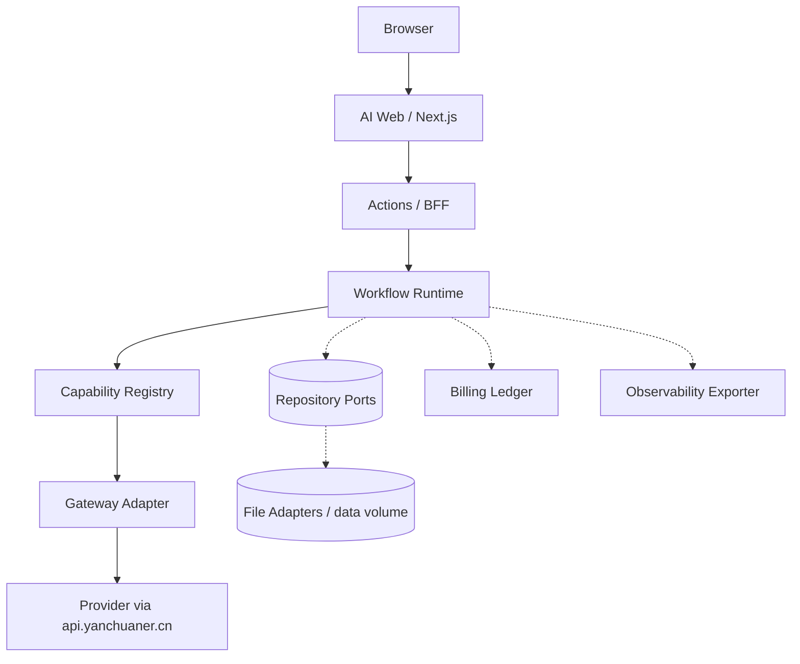

# 燕中 AI（ai_yanchuaner）

燕中 AI 是燕中生态的 **AI 使用层**：它把身份、角色、世界、知识、记忆与工作流组织成可操作的 AI 体验，并只通过统一网关消费模型能力与账本。

- 公开入口：`https://ai.yanchuaner.cn`
- 当前状态：v1.0 文档冻结与生产同步阶段；`ai.yanchuaner.cn` 已在生产运行
- 许可：自主代码与文档采用 AGPL-3.0，第三方组件保持原许可

## 生态边界

| 系统 | 职责 | 本仓不承担 |
| --- | --- | --- |
| 主站 `yanchuaner.cn` | 身份与内容真值 | 不维护用户表、注册或角色 |
| 燕中 API `api.yanchuaner.cn` | AI 网关、能力、策略、额度、账本 | 不计算或修改余额、不保存平台模型密钥 |
| 本仓 `ai_yanchuaner` | 会话、角色、知识、记忆、工作流体验 | 不决定供应商渠道、不保存主站凭据 |

AI 自己**不管理身份和账本**：登录来自主站 OIDC，计费与额度来自燕中 API 网关。浏览器只持有加密 HttpOnly 会话，不接触 YanCore grant、应用 Key 或供应商凭据。

## 核心能力

以下能力均来自当前代码与测试，不包含规划中的功能：

- **Chat Workflow**：普通对话，SSE 流式返回，保留网关 `request_id`。
- **Roleplay Workflow**：注入角色卡、世界观、长期记忆与知识检索后对话。
- **Group Workflow**：2–4 位角色的群聊调度与独立流式发言。
- **Knowledge**：用户级与角色级资料库，向量化经统一网关计费，检索可降级并记录事件。
- **Memory**：角色长期记忆摘要，按用户与角色隔离。
- **Media**：用户自配视觉理解与图片生成服务转发。
- **BYOK**：用户媒体/语音凭据 AES-256-GCM 加密落盘，按用户隔离，可删除，不计入公益额度。
- **Capability Registry**：工作流只依赖稳定能力 ID（如 `text.chat.general`），模型/供应商选择收口到 adapter。
- **Gateway**：OIDC 登录 → YanCore 主体交换 → 短期应用 Key → `api.yanchuaner.cn` 能力调用。
- **Observability**：工作流事件脱敏后写入 JSONL，管理员按 `requestId` 查询，文件按大小轮转。
- **Billing Ledger**：网关执行 reserve / settlement / refund；BFF 对同一 `client_request_id` 去重，防止重试重复扣费。
- **CI/CD 与运维**：GitHub Actions 门禁、备份恢复、磁盘治理与受控故障注入脚本。

## 系统架构



- **Repository**：会话、角色、世界、知识、记忆与 BYOK 设置通过仓储端口访问，文件实现负责原子写入与并发锁。
- **Billing**：本仓不记账；账本由网关产生，本仓只展示并关联 `request_id`。
- **Observability**：事件脱敏后导出，正文与凭据永不落盘。

## 快速开始

### 环境要求

- Node.js 20+（CI 与生产镜像使用 Node 22）
- pnpm `10.12.4`（仓库 `packageManager` 声明，建议 `corepack enable`）
- Docker + Docker Compose（用于 Compose 验证与运维脚本）

### 安装与验证

```bash
pnpm install --frozen-lockfile
pnpm typecheck:ai-web
pnpm test:ai-web
pnpm build:ai-web
pnpm contracts:verify
pnpm release:check
pnpm test:ops
```

### 启动

本地开发：

```bash
pnpm dev:ai-web
```

开发服务器默认监听 `http://localhost:3001`。OIDC、YanCore 与模型对话需要同时运行主站与 API，并从 `.env.example` 创建本地 `.env`，使用开发专用假值或可撤销凭据。

Compose 验证（映射到 `127.0.0.1:3002`）：

```bash
docker compose --profile yancore up -d --build ai-web
docker compose ps
```

## 生产部署

生产部署只使用固定镜像 `ai-yanchuaner/ai-web:<日期>-<短哈希>`，服务器不构建前端。

```bash
# 在构建机（WSL/CI）构建并导出镜像
docker build -t ai-yanchuaner/ai-web:20260817-<短哈希> -t ai-yanchuaner/ai-web:preview -f apps/ai-web/Dockerfile .
docker save ai-yanchuaner/ai-web:20260817-<短哈希> | gzip > ai-web-<短哈希>.tar.gz

# 传输到服务器后加载并启动
docker load < ai-web-<短哈希>.tar.gz
cd /opt/yanchuaner/ai_yanchuaner
docker compose --profile yancore up -d
./scripts/health-check.sh
```

环境变量以 `.env.example` 为唯一模板；生产 `.env` 只允许管理员读取。关键变量：

| 变量 | 说明 |
| --- | --- |
| `AI_WEB_SESSION_SECRET` | 会话与 BYOK 加密密钥，至少 32 位 |
| `YANCORE_OIDC_*` | 主站 OIDC 客户端配置 |
| `YANCORE_API_BASE_URL` | 燕中 API 网关地址 |
| `YANCORE_SUBJECT_EXCHANGE_*` | 主体交换客户端凭据 |
| `AI_WEB_OBSERVABILITY_FILE` | 观测 JSONL 路径（默认 `/data/observability/events.jsonl`） |
| `AI_WEB_OBSERVABILITY_MAX_BYTES` | 观测文件轮转阈值（默认 50 MiB） |

健康检查、日志、备份恢复与故障处理见 [运维文档](docs/operations.md) 和 [部署文档](docs/deployment.md)。

## 开发指南

新增能力前先阅读 [架构文档](docs/architecture.md)，遵守“工作流 → 能力注册表 → 网关端口 → 仓储端口”的依赖方向。

- **新增 workflow**：在 `apps/ai-web/src/workflows/` 定义输入与步骤，使用 `runWorkflow` 发布事件；见 [workflow.md](docs/workflow.md)。
- **新增 capability**：在注册表登记能力 ID、scope 与计费声明，并在 adapter 中解析模型；见 [capability.md](docs/capability.md)。
- **新增 adapter**：保持 `CapabilityAdapter` 契约，不在工作流中写模型名或环境变量；见 [gateway.md](docs/gateway.md)。
- **新增 repository**：定义端口接口，提供文件与内存实现，复用 `withFileLock` 与原子写入；见 [repository.md](docs/repository.md)。

## 测试体系

| 层级 | 位置 | 说明 |
| --- | --- | --- |
| Unit Test | `apps/ai-web/src/**/*.test.ts` | 领域逻辑、事件、加密、解析器与能力适配器 |
| Integration Test | 仓储契约测试、路由测试 | 文件/内存仓储同契约、BFF 路由与 SSE 转发 |
| Acceptance Test | `apps/ai-web/src/acceptance/*.test.ts` | 工作流级端到端（含故障降级） |
| Ops Integration | `scripts/backup-restore.test.mjs` | Docker 卷归档 create/restore 闭环 |
| Real Gateway Acceptance | `scripts/acceptance/run-fault-injection.mjs` | 生产网关受控故障注入（额度、限流、上游、撤销、断流） |

本地跑全部门禁：

```bash
pnpm release:check
```

## 文档

- [文档索引](docs/README.md)
- [架构](docs/architecture.md)
- [工作流](docs/workflow.md)
- [网关](docs/gateway.md)
- [能力注册表](docs/capability.md)
- [仓储](docs/repository.md)
- [观测](docs/observability.md)
- [计费](docs/billing.md)
- [部署](docs/deployment.md)
- [运维](docs/operations.md)
- [安全](docs/security.md)
- [变更记录](CHANGELOG.md)

`docs/phase-*`、`litellm-openwebui-poc.md` 等为历史验收记录，不代表当前架构。

## 来源与许可

本仓自主代码与文档按 [GNU Affero General Public License v3.0](LICENSE) 发布。第三方组件（Next.js、React、openid-client、LiteLLM、Open WebUI 等）保持各自许可与品牌要求，详见 [THIRD_PARTY_NOTICES.md](THIRD_PARTY_NOTICES.md) 与 [版权矩阵](docs/copyright-matrix.md)。

贡献规则见 [CONTRIBUTING.md](CONTRIBUTING.md)，漏洞披露见 [SECURITY.md](SECURITY.md)。
